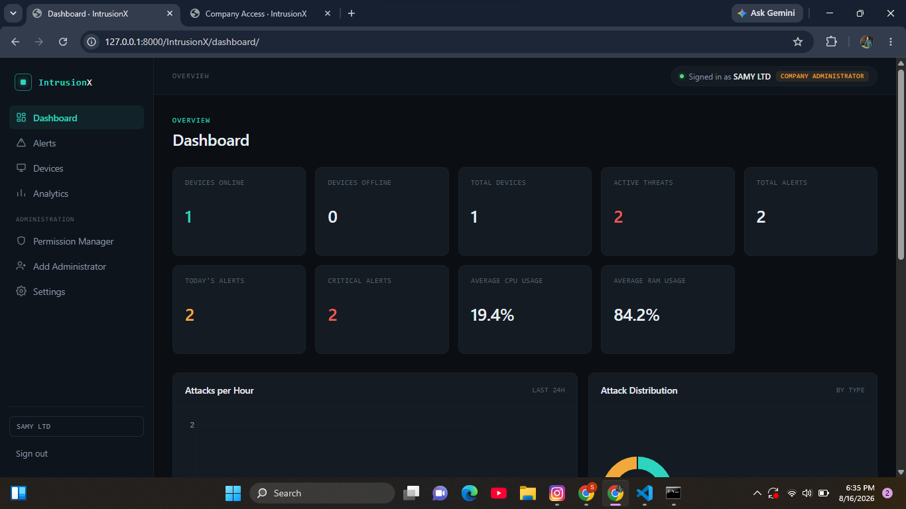
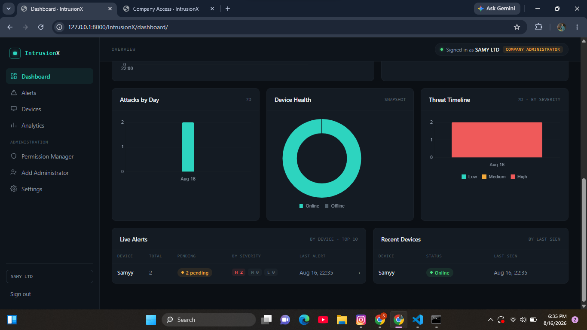
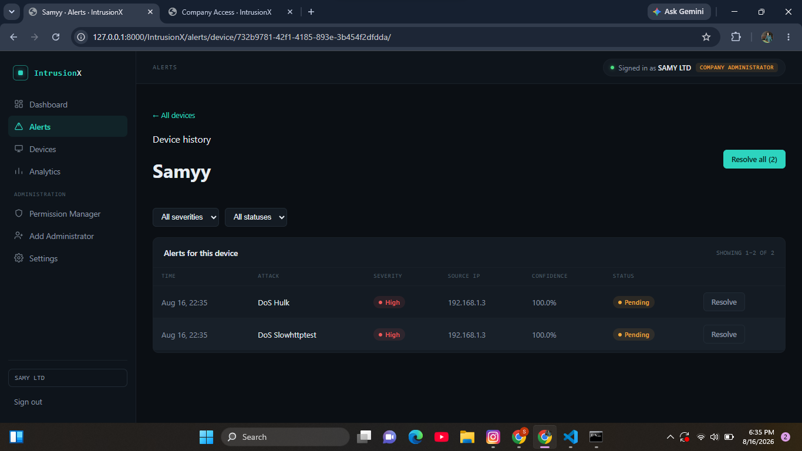
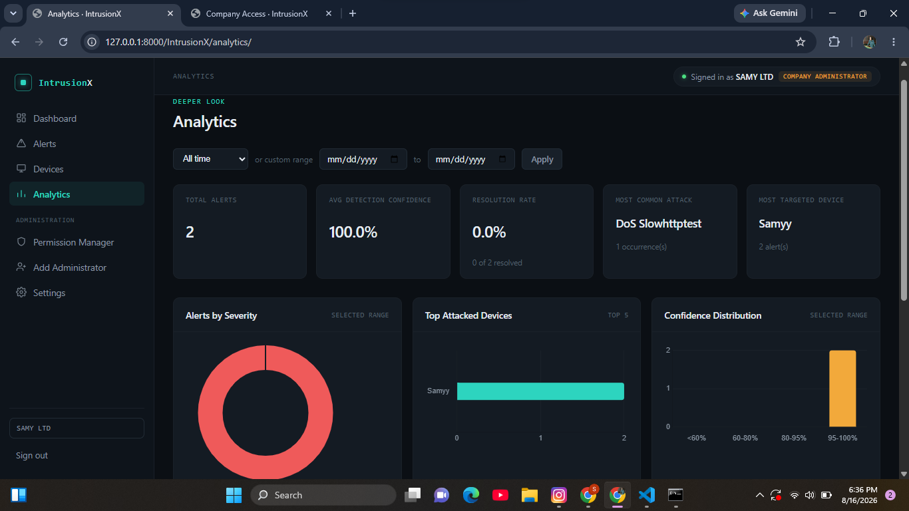
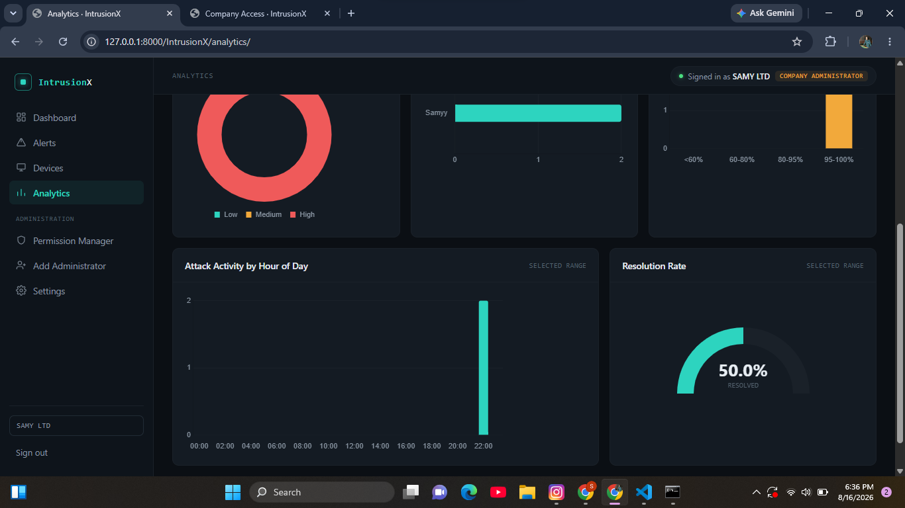
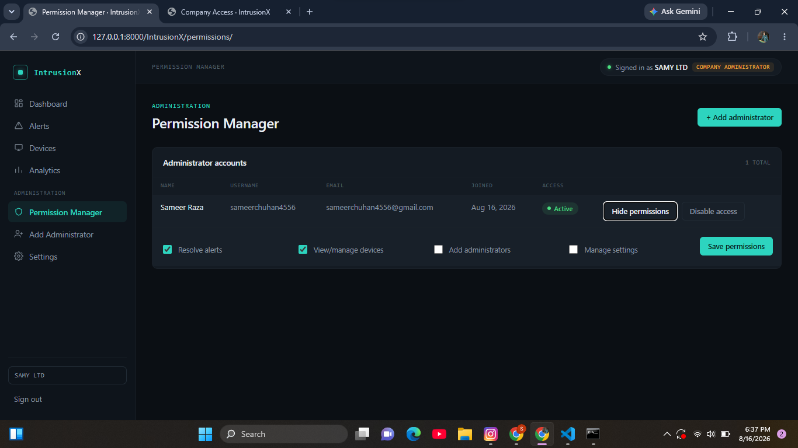
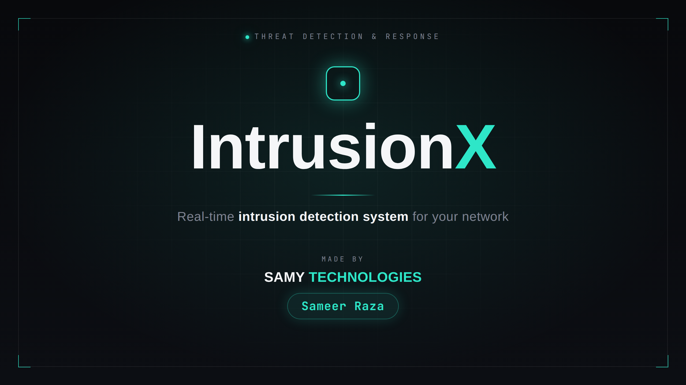
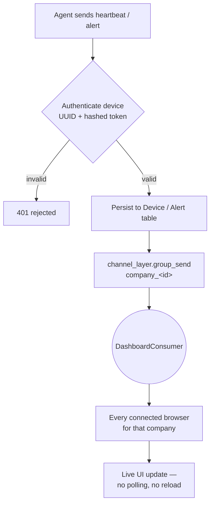
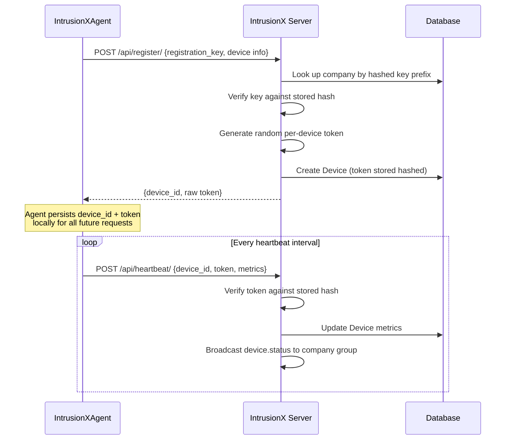
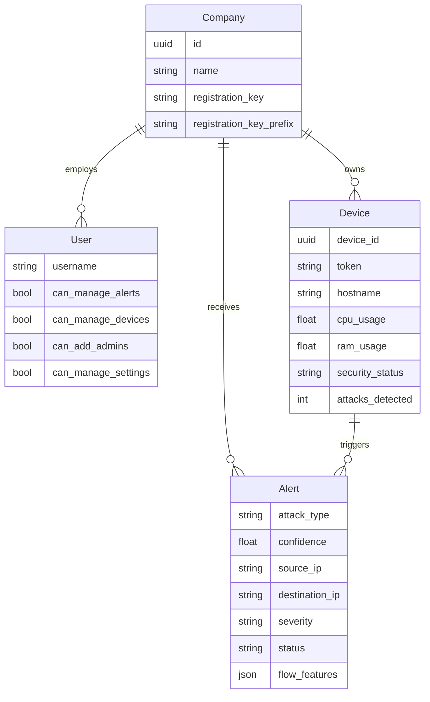

# 🛡️ IntrusionX

> **A multi-tenant network intrusion detection dashboard — built on Django, Channels, and real-time WebSocket telemetry from a fleet of ML-powered endpoint agents.**

IntrusionX is the server-side command center for a distributed intrusion-detection system. Companies register, provision secure enrollment keys, and watch their entire device fleet — CPU/RAM/disk telemetry, live security status, and machine-learning-flagged network attacks — stream into a single real-time dashboard. Every agent authenticates with a hashed per-device token, every alert is deduplicated before it reaches an analyst, and every company's data is strictly isolated behind company-scoped WebSocket channel groups.

This is the companion server to **[IntrusionXAgent](../IntrusionXAgent)** — the lightweight Windows agent that captures live traffic, classifies flows with a trained decision-tree model, and reports back here.


##  Demo

<table>
<tr>
<td width="33%"></td>
<td width="33%"></td>
<td width="33%"></td>
</tr>
<tr>
<td width="33%"></td>
<td width="33%"></td>
<td width="33%"></td>
</tr>
</table>


### [](https://youtu.be/q2XAMKQtJeU)
---

## Overview

IntrusionX is the management-plane half of a two-part intrusion detection system. Companies register on the platform and receive a one-time, high-entropy **registration key**, hashed at rest and looked up via a fast indexed prefix so it never has to be scanned in plaintext. Agents use that key exactly once to self-enroll, receiving back a per-device secret token (also stored hashed) that authenticates every subsequent heartbeat and alert.

Once enrolled, devices push periodic heartbeats carrying resource utilization and security posture, and independently push structured alerts whenever the paired agent's on-device ML model flags a malicious flow. Both events are broadcast instantly to every connected dashboard session for that company over a dedicated `company_<id>` channel group — so an analyst watching the dashboard sees a compromised endpoint light up in real time, with no polling.

On top of that live telemetry pipeline sits a full SOC-style operator experience: company and staff accounts with granular per-admin permissions, alert triage and resolution (individually, per-device, or fleet-wide), a device inventory with live health metrics, and self-service settings including registration-key rotation.

---

## Capabilities

###  Multi-Tenant Company & Access Management
- **Company self-registration** — a company account is created along with a securely hashed registration key used to enroll its own devices.
- **Granular admin permissions** — per-user flags for managing alerts, managing devices, adding other admins, and managing company settings, enforced at the view layer.
- **Staff/company dual login** — separate authentication paths for internal staff and company administrators.
- **Registration key rotation** — companies can regenerate their enrollment key at any time, instantly invalidating the old one for future registrations.

###  Real-Time Device Fleet Monitoring
- **Live heartbeats** — enrolled devices report CPU/RAM/disk usage, IP address, security status, and detection counters on a regular interval.
- **Instant WebSocket propagation** — every heartbeat and every new alert is broadcast immediately to all connected dashboard sessions for that company via Django Channels group messaging — no refresh required.
- **Per-device drill-down** — device detail pages surface live metrics plus the full alert history for that specific machine.
- **Company-scoped isolation** — each dashboard WebSocket connection joins a `company_<id>` group, so telemetry and alerts from one tenant are never visible to another.

###  Intelligent Alert Pipeline
- **ML-driven alert ingestion** — accepts structured attack detections (type, confidence, source/destination IP, protocol, extracted flow features) reported directly by each device's on-board classifier.
- **Automatic deduplication** — repeated alerts of the same attack type from the same device within a configurable time window are suppressed server-side and linked back to the original, keeping the queue from flooding an analyst during a sustained attack.
- **Flexible triage workflows** — resolve individual alerts, resolve every alert for a specific device, or bulk-resolve all currently unassigned alerts.
- **Rich alert context** — every alert stores the full feature vector behind the detection, source/destination IPs, protocol, severity, and a human-readable description for later analysis.

###  Secure Device Enrollment
- **One-time hashed registration keys** — validated with Django's password hasher rather than stored or compared in plaintext, with an indexed prefix for efficient lookup at scale.
- **Per-device secret tokens** — issued once at enrollment, stored hashed, and required (alongside the device's UUID) to authenticate every heartbeat and alert submission.
- **Duplicate-hostname protection** — a company cannot accidentally enroll the same machine twice.

---

## Real-Time Architecture

IntrusionX's live dashboard is powered by Django Channels: every inbound telemetry or alert event from an agent is persisted first, then fanned out over a company-scoped channel group to every connected browser session.



### Enrollment Flow



### Design Principles

| Principle | Implementation |
|---|---|
| **Tenant isolation by construction** | Every WebSocket connection and every query is scoped to `company_id`; there is no cross-tenant read path |
| **No plaintext secrets at rest** | Registration keys and device tokens are hashed with Django's password hasher, never stored or logged in plaintext |
| **Fast secure lookup** | Registration keys use an indexed prefix so authentication doesn't require scanning every company's hash |
| **Alert-flood resilience** | Time-windowed deduplication prevents a single sustained attack from overwhelming the alert queue |
| **Least-privilege administration** | Fine-grained boolean permissions gate alert management, device management, admin creation, and settings access independently |
| **Push, not poll** | All live data reaches the browser via Channels group broadcast, not client-side polling |

---

## Technology Stack

<table>
<tr>
<td valign="top" width="33%">

**Backend**
- Python 3.13
- Django 6.0
- Django Channels (ASGI)
- Daphne
- SQLite

</td>
<td valign="top" width="33%">

**Real-Time**
- Channels `InMemoryChannelLayer`
- Per-company WebSocket groups
- `AsyncWebsocketConsumer`

</td>
<td valign="top" width="33%">

**Security**
- Django password hashers for keys/tokens
- Session + role-based access control
- CSRF-protected form endpoints

</td>
</tr>
</table>

**Two Django apps, one project:** `Entron` serves the authenticated, human-facing dashboard (login, alerts, devices, analytics, permissions, settings), while `EntronApi` is the machine-facing surface agents talk to (`register/`, `heartbeat/`, `alerts/`) — keeping human and agent-facing concerns cleanly separated.

---

## Data Model



---

## API Reference

### Agent-facing API (`EntronApi`) — device authentication via UUID + hashed token

| Method | Endpoint | Purpose |
|---|---|---|
| `POST` | `/api/register/` | Enroll a new device using a company registration key; returns `device_id` + secret token |
| `POST` | `/api/heartbeat/` | Report live resource usage and security status; keeps the device marked online |
| `POST` | `/api/alerts/` | Submit a detected attack (type, confidence, IPs, protocol, feature vector) |

### Dashboard (`Entron`) — session-authenticated, human-facing

| Method | Endpoint | Purpose |
|---|---|---|
| `GET`/`POST` | `/IntrusionX/login/` | Company administrator login |
| `GET`/`POST` | `/IntrusionX/admin/` | Internal staff login |
| `GET`/`POST` | `/IntrusionX/register/` | Register a new company account |
| `GET`/`POST` | `/IntrusionX/register_company/` | Company self-registration flow |
| `POST` | `/IntrusionX/logout/` | End the current session |
| `GET` | `/IntrusionX/dashboard/` | Live fleet + alert overview |
| `GET` | `/IntrusionX/alerts/` | Alert triage queue |
| `POST` | `/IntrusionX/alerts/<id>/resolve/` | Resolve a single alert |
| `GET` | `/IntrusionX/alerts/device/<device_id>/` | Alert history for one device |
| `POST` | `/IntrusionX/alerts/device/<device_id>/resolve-all/` | Resolve every alert for a device |
| `GET` | `/IntrusionX/alerts/unassigned/` | Alerts not yet linked to a resolved device |
| `POST` | `/IntrusionX/alerts/unassigned/resolve-all/` | Bulk-resolve unassigned alerts |
| `GET` | `/IntrusionX/devices/` | Full device inventory |
| `GET` | `/IntrusionX/devices/<device_id>/` | Device detail + live metrics |
| `GET` | `/IntrusionX/analytics/` | Fleet-wide analytics |
| `GET`/`POST` | `/IntrusionX/permissions/` | Manage admin roles |
| `POST` | `/IntrusionX/permissions/<user_id>/toggle/` | Enable/disable an admin account |
| `POST` | `/IntrusionX/permissions/<user_id>/update/` | Update an admin's permission flags |
| `GET`/`POST` | `/IntrusionX/settings/` | Company settings |
| `POST` | `/IntrusionX/settings/regenerate-key/` | Rotate the company's registration key |
| `POST` | `/IntrusionX/settings/change-password/` | Change the company account password |
| `WS` | `/ws/dashboard/` | Real-time channel for live device + alert updates |

---

## Project Structure

```text
IntraX/
├── manage.py
├── db.sqlite3
│
├── Entron/                        # Human-facing dashboard app
│   ├── models.py                    # Company, User, Device, Alert
│   ├── views.py                      # Auth, dashboard, alert triage, devices, settings
│   ├── consumers.py                   # DashboardConsumer — company-scoped WebSocket group
│   ├── routing.py                      # ws/dashboard/ WebSocket route
│   ├── urls.py                          # Dashboard URL routing
│   ├── static/                           # Dashboard assets
│   └── templates/                         # Dashboard templates
│
├── EntronApi/                     # Machine-facing agent API
│   ├── views.py                     # register_pc, heartbeat, alert (+ dedup + broadcast)
│   └── urls.py                       # /api/register/, /api/heartbeat/, /api/alerts/
│
└── IntraX/                        # Project configuration
    ├── settings.py                  # Channels, apps, database, auth
    ├── asgi.py                       # ASGI entrypoint — HTTP + WebSocket
    └── urls.py                        # Root routing → IntrusionX/, api/
```

---

## Installation

### Requirements
- Python 3.13
- pip

### Setup

```bash
git clone YOUR_REPOSITORY_URL
cd IntraX
python -m venv venv
```

**Windows**
```bash
venv\Scripts\activate
```

**Linux / macOS**
```bash
source venv/bin/activate
```

```bash
pip install -r requirements.txt
python manage.py migrate
python manage.py create_admin

# NOW LOGIN AS ADMIN / ADMIN AND REGISTER COMPANY 

python manage.py runserver

# NOW LOGIN AS A COMPANY
```

Daphne serves HTTP and WebSocket traffic through the same ASGI application, so a single `runserver` command brings up both the dashboard and the live telemetry channel.

---

## Configuration

`IntraX/settings.py` includes:

```python
AUTH_USER_MODEL = "Entron.User"

CHANNEL_LAYERS = {
    "default": {
        "BACKEND": "channels.layers.InMemoryChannelLayer",
    },
}

ASGI_APPLICATION = "IntraX.asgi.application"
```

The in-memory channel layer is ideal for local development and single-process deployments. For multi-process production deployments, swap in `channels_redis` to broadcast across multiple server workers with no application code changes. For production, move `SECRET_KEY` to an environment variable, disable `DEBUG`, and switch the database to PostgreSQL.

---

## Usage

1. **Register a company** — create an account and receive a hashed, one-time registration key.
2. **Enroll devices** — install and run [IntrusionXAgent](../IntrusionXAgent) on each endpoint, supplying the registration key once.
3. **Watch the fleet live** — enrolled devices appear on the dashboard with real-time CPU/RAM/disk metrics and security status.
4. **Respond to alerts** — when an agent's ML model flags malicious traffic, the alert appears instantly; triage it individually, per-device, or in bulk.
5. **Manage access** — invite additional company admins and scope their permissions across alerts, devices, admins, and settings.
6. **Rotate credentials** — regenerate the company's registration key at any time from Settings.

---

## Engineering Highlights

- **True multi-tenant isolation** — every real-time channel, query, and permission check is scoped to `company_id`, with no shared global state between tenants.
- **Secrets never stored in plaintext** — both registration keys and per-device tokens are hashed with Django's password hasher and verified with constant-time comparison.
- **Alert-storm resilience** — a time-windowed deduplication layer sits directly in the ingestion path, preventing a single compromised host from flooding the alert queue during a sustained attack.
- **Clean human/machine API separation** — `Entron` (dashboard) and `EntronApi` (agent ingestion) are separate Django apps with distinct authentication models, keeping session-based and token-based auth from ever mixing.
- **Push-based real-time design** — Channels group broadcasting means the dashboard reflects fleet state within milliseconds of an event, with zero client-side polling.

---

## Skills Demonstrated

**Backend Engineering** — Django ORM design across a multi-tenant schema, custom user model with role-based permissions, session and token-based dual authentication, efficient indexed key lookups.

**Real-Time Systems** — Django Channels, ASGI, WebSocket group messaging, per-tenant channel isolation, event-driven UI updates.

**Security Engineering** — hashed-secret storage and verification, device authentication design, alert deduplication as a denial-of-service mitigation, permission-gated administrative actions.

**System Design** — clean separation between a human-facing control plane and a machine-facing ingestion API, designed to pair with a distributed fleet of independent agents.

**API Design** — RESTful JSON endpoints for agent enrollment and telemetry, consistent error handling, and real-time push endpoints alongside conventional request/response routes.

---

## Related Project

**[IntrusionXAgent](../IntrusionXAgent)** — the Windows endpoint agent that captures live network traffic, extracts flow features, classifies them with a trained decision-tree model, and reports device health and detected attacks to this server.

---

## Roadmap

```markdown
- [x] Multi-tenant company registration with hashed enrollment keys
- [x] Secure per-device token authentication
- [x] Real-time WebSocket dashboard via Django Channels
- [x] Alert deduplication window
- [x] Role-based admin permissions
- [x] Registration key rotation
- [ ] Redis-backed channel layer for multi-worker production deployments
- [ ] Email/SMS notification on critical-severity alerts
- [ ] Exportable analytics and reporting
- [ ] Two-factor authentication for company admins
- [ ] Public REST API with API-key access for external SIEM integration
```

## Future Enhancements

IntrusionX's architecture was built with room to grow:

- **Multi-worker scalability** — swapping the in-memory channel layer for `channels_redis` is a drop-in configuration change that unlocks horizontal scaling of the real-time layer.
- **SIEM integration** — the alert schema (attack type, confidence, IPs, protocol, full feature vector) is already structured for export to external security tooling.
- **Notification channels** — the existing broadcast pipeline generalizes naturally toward pushing high-severity alerts to email, SMS, or a messaging webhook.
- **Federated deployments** — the company-scoped channel group design extends naturally toward supporting multiple regional server instances behind a shared identity layer.

---

## Developer

**Sameer Raza**

Building secure, real-time, full-stack systems with a focus on genuine cryptographic and detection engineering rather than surface-level "secure" branding.

- GitHub:  [Sameer Raza](https://github.com/sameer2675)
- LinkedIn: [Sameer Raza](https://www.linkedin.com/in/sameer-raza-233717319/)